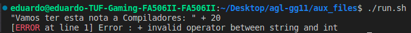
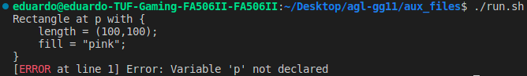
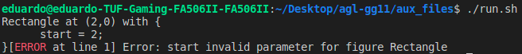
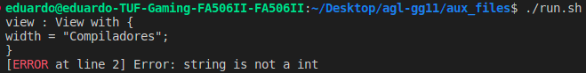

# Tema **AGL**, grupo **agl-gg11**
-----

## Constituição dos grupos e participação individual global

| NMec | Nome | Participação |
|:---:|:---|:---:|
| 107322 | BERNARDO DE ALMEIDA MARUJO | 30% |
| 108780 | DAVID FREITAS PALRICAS | 30% |
| 104179 | EDUARDO JOSÉ MENESES ALVES | 30% |
| 108445 | TOMÁS HENRIQUES VIANA | 10% |

## Relatório

### Estrutura do repositório

- **requirements.txt** -- executar "pip install -r requirements.txt" para instalar as bibliotecas de Python necessárias.

- **src** -- contém todo o código fonte do projeto.

- **doc** -- contém toda a documentação adicional a este README.

- **examples** -- contém os exemplos concebidos pelos professores.

- **aux_files** -- contém ficheiros batch criados para facilitar o debugging. Estes ficheiros correm os exemplos concebidos pelos professores, correm ficheiros e executam comandos do antlr.

### Objetivos gerais do projeto

- **Definição da linguagem AGL** -- associada a ficheiros com a extensão agl, que permite a definição de figuras gráficas 2D e a sua visualização com animação e interação.

- **Construção de um analisador semântico** -- deteta e sinaliza erros de descrição AGL que escapam à análise sintática.

- **Construção de um analisador compilador** -- permite transformar uma descrição AGL num programa equivalente na linguagem destino (Python3), usando a biblioteca tkinter, e que, quando executado, produza  visualização desejada.

- **Definição de linguagem secundária xAGL** -- que auxilia a linguagem principal AGL e permita a importação de elementos auxiliares, cujos elementos,em runtime, possam ser carregados pelo programa final.

### O que é o AGL?

AGL é uma linguagem que permite a instanciação de figuras gráficas 2D, sobre uma área de trabalho com dimensões ilimitadas, canvas, onde é permitida também a instanciação de vistas (views), que permitem capturar o estado do canvas numa dada região, com um determinado zoom e num determinado instante de tempo. As instâncias dos modelos gráficos podem, ao longo do tempo, mudar a sua posição e as suas propriedades, mas, apenas quando uma vista é refrescada é que as alterações são capturadas pela vista.

### Gramática

A gramática desenvolvida refere-se a um conjunto de regras que determina a sintaxe da linguagem de programação AGL. Essas regras especificam como os símbolos e as palavras-chave do AGL podem ser combinados para formar estruturas sintáticamente corretas, tal como expressões, instruções e até programas completos. De seguida iremos referir passo a passo o conjunto de condições desenvolvidas ao longo da nossa gramática.

- **Ponto de começo**: O ponto de começo da nossa gramática é o "program", que aceita várias instruções ('stat') seguidas pelo fim do ficheiro (EOF).

- **importSmt**: Representação sintática de importação de um ficheiro, cujo propósito será importar a linguagem secundária xAGL. 

- **Stat**: O stat descreve um tipo de instrução que pode ocorrer ao longo do nosso programa e representa vários tipos de declarações: view_actions (move, refresh, wait e close), view, figures, variable_declaration, variable_parameters, print, with, for e expr.

#### De seguida definimos a análise sintática para as seguintes condições:

- **for**: representa a estrutura do ciclo "for" que itera de uma expressão inicial até uma expressão final, de forma a executar uma série de ações.

- **wait_command**: representa a estrutura do comando "wait mouse click" em uma view. O objetivo deste comando é esperar pelo click do rato por parte do utilizador, resumir o programa previamente congelado e retornar as coordenadas do ponto onde o utilizador clickou na view.

- **expr**:  representa o conjunto de expressões unárias, de valores inteiros, de tempo, reais, vectores, pontos, strings, IDs, Booleanos, expressões lógicas, not (negação), expressões de comparação, expressões de adição e subtração, expressões de multiplicação, divisão e resto, tal como expressões entre parêntesis.

- **print**: representa a sintaxe da estrutura que define um comando de impressão. Começa com a palavra 'print', e de seguida, uma string ou um ID, terminando com um ';'.

- **variable_declaration**: representa a estrutura sintática da declaração de variáveis.

- **variable_parameters**: representa a sintaxe da estrutura que define uma declaração de parâmetros de variável, onde deve haver um ID seguido por um '.'e por um estado 'state' e por fim, um ';'.

- **state**: representa a sintaxe da estrutura que define uma declaração de estado, onde deve haver a palavra 'state', seguida por um sinal '=' e por uma string, terminando com ';'.

- **type**: representa a sintaxe de todos os diferentes nomes que representam um tipo de dados.

- **figures**: representa a sintaxe da estrutura que define comandos para posicionar figuras em coordenadas, podendo incluir operadores adicionais, com diversas variações na forma como as coordenadas e operadores são especificados.

- **figure**: representa as diversas tipos de figuras que existem, sendo estas: Dot, Line, Rectangle, Ellipse, Text, Arc, ArcChord e PieSlice.

- **figures_params**: representa a sintaxe dos vários parâmetros de entrada das figuras, sendo estas: length, start, extent, fill, outline e text.

- **figure_angles**: representa a sintaxe das propriedades de algumas figuras, 'start' e 'extent', que recebem um valor inteiro ou um valor real. 

- **figure_colors**: representa a sintaxe das propriedades de algumas figuras, 'fill' e 'outline', que recebem uma cor. 

- **length**: Estrutura sintática que representa um comprimento, tendo que receber um vetor.

- **text**: Estrutura sintática que representa um texto.

- **view_actions**: representa os diversos tipos de comandos da view (move, refresh, wait ou close).

- **close**: representa a sintaxe do comando de fechar uma vista.

- **move**: representa a sintaxe do comando de mover uma vista com base em um ponto.

- **refresh**: representa a sintaxe do comando de refresh de uma janela, sendo o refresh necessário para capturar as alterações em uma vista, este refresh pode ser instantâneo, ou após um determinado tempo. 

- **view**: representa a sintaxe de instanciação de uma vista, sendo possivel usar a sintaxe "with" para definir parâmetros. Caso a sintaxe with não seja usada, instancia a view com os valores default.

- **with**: representa a sintaxe de atribuição de valores a parâmetros de figuras ou de vistas com um determinado ID.

- **with_operator**: representa a sintaxe de atribuição de valores a parâmetros de uma figura ou de uma vista.

- **view_params**: representa os diversos tipos de parâmetros da view, sendo estes as coordenadas da vista, a altura e largura da vista, o titulo da vista e a cor de fundo da vista. 

- **view_measures**: Estrutura sintática que representa os parâmetros de medidas de uma vista, sendo estes width e height.

- **view_axis**: Estrutura sintática que representa a coordenada x do ponto de origem da view ou a coordenada y do ponto de origem da view.

- **title**: Estrutura sintática que representa o titulo de uma view.

- **background**: Estrutura sintática que representa a cor de fundo de uma view.

- **color**: Estrutura sintática que representa uma cor.

- **time**: Estrutura sintática que representa um valor de tempo em milissegundos ou segundos.

- **point**: Estrutura sintática que representa um ponto de 2 coordenadas cujas coordenadas podem ser dois valores inteiros ou dois valores reais.

- **vector**: Estrutura sintática que representa um vetor.

- **INT**: Estrutura sintática que representa um valor inteiro, aceita valores de 0 a 9, uma ou mais vezes.

- **NUMBER**: Estrutura sintática que aceita dois inteiros que se encontrem com um '.' entre eles (Representando um número real).

- **STRING**: Estrutura sintática que aceita qualquer caráter entre aspas duplas.

- **BOOL**: Estrutura sintática das expressões Booleanas 'True' e 'False'.

- **ID**: Estrutura sintática de um identificador que aceita qualquer identificador que comece com letra ou _.

- **WS**: Ignora espaços em branco.

- **LINE_COMMENT**: Aceita qualquer carácter apõs # excetro quebras de linha ou mudanças de linha.

- **BLOCK_COMMENT**: Aceito qualquer carácter entre #( e #).

### Análise de semântica

De seguida, construímos a análise semântica, esta tem a função de verificar se as construções do código fonte fazem sentido no contexto da Linguagem AGL.

Para esta verificação semântica do nosso projeto usamos um visitor, semantic_analysis, do tipo Boolean. Neste visitor fazemos uso da classe ErrorHandling disponiilizada pelo professor Miguel Oliveira e Silva, que se encontra no elearning da disciplina de Compiladores.

Fizemos uso das estruturas de dados Hashtables e Listas de forma a armazenar os types compativeis na utilização de operadores basicos (+, -, ()), operadores de Multiplicação, divisão e módulo (*,/,%), Operadores logicos (&&,||,!), etc.. 

De forma a testar o analisador semântico desenvolvido foram usados os exemplos concebidos pelos professores e um ficheiro de testes desenvolvido pelo grupo para procurar e testar possiveis anomalias. 

Os principais objetivos e tarefas da nossa análise semântica foram:

- **Incompatilibilidade de Tipos**: A análise semântica desenvolvida previne que se tente realizar uma operação entre tipos de dados que não são compatíveis ou que se tente atribuir um valor a uma variável cujo tipo de dados é incompatível com o tipo da variável de destino.
- **Utilizar uma variável não declarada**: A análise semântica desenvolvida previne que se tente utilizar uma varíavel que não tenha sido previamente instanciada.
  
- **Parâmetros inválidos**: A análise semântica desenvolvida previne que uma View contenha parâmetros de uma figurea e vice-versa.
  
- **Utilização de valores com um tipo diferente do instanciado**: A análise semântica impede o uso de um tipo diferente daquele que foi inicialmente atribuído a uma variável.
  
- **Validação de parâmetros do ciclo for**: A análise semântica previne o uso de parâmetros inválidos num ciclo for.

- **Verificação de parâmetros únicos para cada tipo de figuras**: A análise semântica verifica que um tipo de figura não tenha parâmetros inválidos para o tipo de figura que é. (p.e um rectângulo não pode ter parâmetros de ângulos).

- **Validação do tipo de dados de Views e Figuras**: A análise semântica previne que cada parâmetro de view ou de figura aceite tipos de dados incorretos.

### Alguns exemplos de verificações da Análise Semântica
  Exemplo para incompatibilidade de Tipos:
  
  

  Exemplo para utilizar uma variável não declarada:

  

  Exemplo para verificação de parâmetros únicos para cada tipo de figuras:

  

  Exemplo para validação do tipo de dados de Views e Figuras:

  


### Classes para suporte

Para a verificação do tipo de dado de uma expressão/variável utilizámos a classe Type fornecida pelos professores no elearning, e criámos novas classes herdadas desta para verificar cada tipo de dados do AGL.
Segue-se o nome de cada class nova criada e o tipo de dados que suporta.

- **Type**: Classe abstrata "Type" fornecida pelos professores.

- **BoolType**: Classe que representa o tipo de dados Booleanos.

- **FigureType**: classe que representa o tipo de dados das Figuras.

- **StringType**: Classe que representa o tipo de dados de Strings.

- **TimeType**: Classe que representa o tipo de dados de Tempo.

A classe HexcodeType e ColorType são subclasses da classe StringType. 

- **HexcodeType**: Classe que representa o tipo de dados de códigos hexadecimais, úteis para a definição de cores.
  
- **ColorType**: Classe que representa o tipo de dados de cor.

- **CoordinateType**: Classe que representa o tipo de dados de coordenadas, esta aceita pontos e vectores.

A classe PointType e VectorType são sublasses de CoordinateType.

- **VectorType**: Classe que representa o tipo de dados de vetores.

- **PointType**: Classe que representa o tipo de dados de Pontos.

A classe WaitType é uma sublasse de PointType.

- **WaitType**: Classe que representa um wait mouse click, representa a instanciação de um ponto e espera por um click do rato.
  
- **NumericType**: Classe que representa o tipo de dados de valores inteiros ou reais.

A classe NumberType e IntegerType são subclasses da classe NumericType.
  
- **IntegerType**: Classe que representa o tipo de dados de valores inteiros.
  
- **NumberType**: Classe que representa o tipo de dados de valores reais.

### AGL_Library

Criámos um ficheiro python ao qual designámos AGL Library, onde estão presentes as class View, Figure, tal como as subclasses de Figure: Dot, Line, Rectangle, Ellipse, Text, Arc, Archord e PieSlice.
De seguida, referimos os metódos presentes em cada uma destas classes.

**Figure**: Classe com métodos abstratos que serão herdados pelas suas subclasses (as várias figuras). 

| Método | Descrição |
|--------|-----------|
| init   | Método abstrato de inicialização que define as coordenadas iniciais da figura e inicializa os atributos "id": que serve para identificar a própria figura, e "canvas": que serve para identificar a view onde a figura foi instanciada.|
| draw   | Método abstrato responsável por desenhar a figura na View onde guardará o seu atributo "id" e "canvas". |
| move   | Método abstrato que permite mover a figura para novas coordenadas especificadas. |
| remove | Método abstrato que remove a figura da view onde foi instanciada. |


**View**: De seguida estão apresentados os métodos presentes na classe View e uma breve descrição dos mesmos.

| Métodos | Descrição                                            |
|---------|------------------------------------------------------|
| refresh | Renova a view, alterando-a para cumprir com as novas alterações. |
| add     | Adiciona figuras ao canvas.                         |
| close   | Fecha o canvas e a janela.                          |
| move    | Permite mover a view, alterando a sua posição.      |

**Figures**: De seguida estão apresentados cada Figura e os métodos presentes nos mesmos, tal como uma breve descrição destes.

 Figure       | init                      | draw                             | Move                          |
|-------------|---------------------------|----------------------------------|-------------------------------|
| Dot         | Inicialização do ponto    | Desenha o ponto no canvas        | Move o ponto no canvas        |
| Line        | Inicialização da Linha    | Desenha a Linha no canvas        | Move a Linha no canvas        |
| Rectangle   | Inicialização do Retângulo| Desenha o Retângulo no canvas    | Move o Rectângulo no canvas   |
| Ellipse     | Inicialização da Elipse   | Desenha a Elipse no canvas       | Move a Elipse no canvas       |
| Text        | Inicialização do Texto    | Desenha o Texto no canvas        | Move o Texto no canvas        |
| Arc         | Inicialização do Arco     | Desenha o Arco no canvas         | Move o Arco no canvas         |
| ArcChord    | Inicialização do ArcoChord| Desenha o ArcoChord no canvas    | Move o ArcoChord no canvas    |
| PieSlice    | Inicialização do PieSlice | Desenha o PieSlice no canvas     | Move o PieSlice no canvas     |

**wait_for_click**: Foi também desenvolvida uma classe para o wait for mouse click, que bloqueia o programa e permite ao utilizador resumir esse programa e obter as coordenanas do ponto onde clickou na view.

| Métodos          | Descrição                                                                 |
|------------------|---------------------------------------------------------------------------|
| __init__         | Inicializa a instância da classe ClickListener, define click_coordinates como None. |
| on_click         | Método chamado quando se clicka no rato. QUando o botão do rato é pressionado (pressed), armazena as coordenadas do ponto onde o utilizador clicka.|
| wait_for_click   | Espera que o utilizador click com o rato, enquanto isso, retorna a mensagem "wait mouse click", inicia o listener do rato e retorna as coordenadas do click do rato quando este ocorre. |

### Linguagem Secundária: xAGL

De seguida, desenvolvemos uma linguagem secundária, xAGL, cujo objectivo é auxiliar a linguagem principal de alguma maneira (por exemplo, definindo modelos).

### Compilador

A função do compilador no nosso projeto, aglCompiler, é traduzir a linguagem AGL num programa equivalente na linguagem destino, que no caso proposto, é Python, usando a biblioteca Tkinter.
Para isto, foram usados String Templates (presentes no ficheiro python.stg), cujo propósito é facilitar a geração do código Python. O compilador desenvolvido faz uso da classe ST e por fim gera código em formato python no ficheiro out.py, presente na pasta "src".

O ficheiro python.stg que desenvolvemos contém várias funções, no entanto, funções relativamente mais simples de implementar foram feitas diretamente no compilador.java usando o construtor para o ST.

Por exemplo, para um caso mais simples fazemos:

```java
ST res = new ST ("<text>");
```

Para uma função mais elaborada usamos:

```java
ST res = stg.getInstanceOf("figure_angles");
```
Neste último exemplo, é usada a instância presente no "python.stg" que corresponde a "figure_angles".

O ficheiro python.stg importa tudo do agl_library, desta forma não terá de estar constantemente a criar todos as classes sempre que necessárias, estando estas já definidas nesse ficheiro (agl_library).


## Contribuições

Cada membro contribuiu nos parâmetros referidos abaixo:

-**Gramática**: BERNARDO DE ALMEIDA MARUJO, DAVID FREITAS PALRICAS, EDUARDO JOSÉ MENESES ALVES, TOMÁS HENRIQUES VIANA

-**Análise Semântica**: BERNARDO DE ALMEIDA MARUJO, DAVID FREITAS PALRICAS, EDUARDO JOSÉ MENESES ALVES

-**Compilador**: BERNARDO DE ALMEIDA MARUJO, DAVID FREITAS PALRICAS, EDUARDO JOSÉ MENESES ALVES

-**Linguagem Secundária**: BERNARDO DE ALMEIDA MARUJO, DAVID FREITAS PALRICAS, EDUARDO JOSÉ MENESES ALVES, TOMÁS HENRIQUES VIANA

-**Relatório**: BERNARDO DE ALMEIDA MARUJO, DAVID FREITAS PALRICAS, EDUARDO JOSÉ MENESES ALVES


